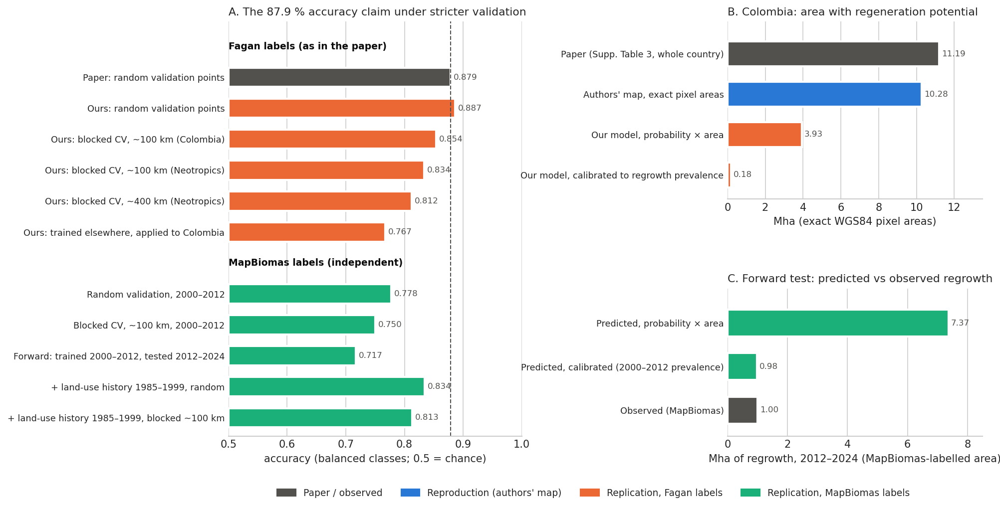

# natural-regeneration-replication

[](https://github.com/annefou/natural-regeneration-replication/actions/workflows/ci.yml)
[](https://annefou.github.io/natural-regeneration-replication/)
[](https://github.com/annefou/natural-regeneration-replication/pkgs/container/natural-regeneration-replication)
[](https://opensource.org/licenses/MIT)
[](https://doi.org/10.5281/zenodo.23137988)
[](docs/fair4rs-checklist.md)
[](https://forrt.org/)
[](nanopubs/PUBLISHED.md)
[](ro-crate-metadata.json)
[](https://archive.softwareheritage.org/browse/origin/?origin_url=https://github.com/annefou/natural-regeneration-replication)

> Replication of **Williams, B. A. et al. (2024). Global potential for natural regeneration in deforested
> tropical regions.** Nature 636, 131–137. [doi:10.1038/s41586-024-08106-4](https://doi.org/10.1038/s41586-024-08106-4)

**Read the results:** <https://annefou.github.io/natural-regeneration-replication/>

## Summary

We tested the paper's claim that its 30 m random-forest model of natural regeneration has **87.9 %**
validation accuracy, in **Colombia**, with independent code and open data. The protocol follows the
robustness checks suggested by The Unjournal's evaluators
([doi:10.21428/d28e8e57.5411b150](https://doi.org/10.21428/d28e8e57.5411b150)).

**Verdict: partially supported.**

- The accuracy reproduces under the paper's random validation: **0.887** (paper: 0.879).
- It is lower when predicting unseen places and periods: 0.812–0.869 with spatially blocked
  validation, **0.767** for a model trained outside Colombia, **0.717** for predicting 2012–2024
  regrowth from 2000–2012 (independent MapBiomas labels).
- Summing probability × area overstated realised future regrowth about seven times; prevalence
  calibration fixed it. Supplementary Table 4 areas match a nominal 0.09 ha pixel count.
- Land-use history from 1985–1999 improves the model (0.778 → 0.834).



Details: [`index.md`](index.md) (book front page), the Outcome draft
[`nanopubs/drafts/05_outcome.md`](nanopubs/drafts/05_outcome.md), and all implementation choices in
[`docs/deviations.md`](docs/deviations.md).

## Running the pipeline

```bash
git clone https://github.com/annefou/natural-regeneration-replication.git
cd natural-regeneration-replication
pixi install
pixi run snakemake --cores 12 --config smoke=1   # small end-to-end test
pixi run snakemake --cores 12                    # full run: tens of GB, several hours
```

The full run needs a NASA Earthdata login in `~/.netrc` (SRTM slope; MODIS burned-area fallback).
Everything else is downloaded without a login. Progress, expected outputs and how to resume after a
failure: [`results/logs/RUN_STATUS.md`](results/logs/RUN_STATUS.md). The Docker image runs the same
pipeline: `docker run --rm ghcr.io/annefou/natural-regeneration-replication:latest`.

CI does not run the full pipeline (too heavy for GitHub runners); it runs the unit tests and a
Snakemake dry run, and the Jupyter Book renders the notebooks executed in the full local run.

## Repository structure

```
.
├── Snakefile                   # pipeline (download → labels/features → analyses → figures)
├── notebooks/                  # jupytext .py sources + executed .ipynb rendered by the book
├── results/                    # result tables (CSV, NetCDF) and run logs
├── figures/                    # main_result.png and supporting figures
├── nanopubs/                   # FORRT chain drafts (not yet published) + published-URI registry
├── docs/                       # deviations.md, data-access-probe.md, template reference docs
├── paper/                      # paper, Author Correction, supplementary information (CC BY-NC-ND 4.0)
├── data/                       # downloaded inputs (gitignored)
├── pixi.toml + pixi.lock       # pinned environment
├── CITATION.cff, codemeta.json, ro-crate-metadata.json
└── CLAUDE.md, DOMAIN.md, USER_PREFERENCES.md   # AI-assistant operating manual from the template
```

## Citation

- This replication: [`CITATION.cff`](CITATION.cff), DOI [10.5281/zenodo.23137988](https://doi.org/10.5281/zenodo.23137988)
- The original paper: [10.1038/s41586-024-08106-4](https://doi.org/10.1038/s41586-024-08106-4)
- The Unjournal evaluation: [10.21428/d28e8e57.5411b150](https://doi.org/10.21428/d28e8e57.5411b150)

## Acknowledgements

Built from [`sciencelivehub/forrt-replication-template`](https://github.com/sciencelivehub/forrt-replication-template),
part of the [Science Live platform](https://platform.sciencelive4all.org). Data providers and licences are
listed in [`index.md`](index.md) § Data.
